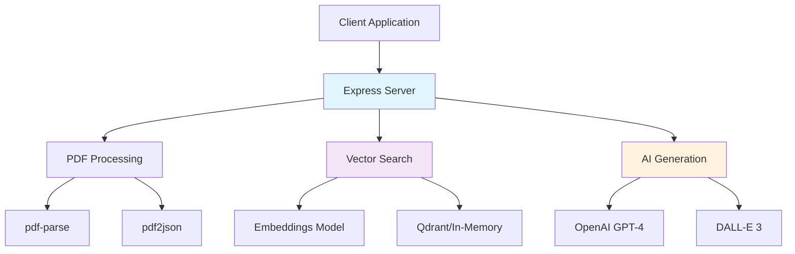

# Lurniva RAG

**AI-Powered Document Intelligence & Educational Content Generation**

[](package.json)
[](LICENSE)
[](https://nodejs.org/)
[](https://openai.com/)

Transform any PDF document into an interactive learning experience with advanced AI capabilities. Lurniva RAG combines document processing, semantic search, and AI-powered content generation to create comprehensive educational resources.

## ✨ Key Features

🔍 **Smart Document Processing**: Advanced PDF text extraction with multiple fallback methods  
📚 **Semantic Search**: Vector-based similarity search using state-of-the-art embeddings  
🎓 **AI Tutoring**: Interactive Q&A with context-aware responses  
📝 **Quiz Generation**: Automatic creation of multiple choice, T/F, and short answer questions  
📊 **Lecture Creation**: Structured educational content with learning objectives  
🎨 **Visual Content**: AI-generated educational images and charts  
✅ **Smart Grading**: Automated assessment with detailed feedback  
🔄 **Remedial Learning**: Adaptive content for improved understanding  

## 🚀 Quick Start

### Prerequisites
- **Node.js 18+** - [Download here](https://nodejs.org/)
- **OpenAI API Key** - [Get one here](https://platform.openai.com/api-keys)

### Installation

```bash
# Clone the repository
git clone <repository-url>
cd Lurniva-RAG

# Install dependencies
npm install

# Configure environment
cp .env.example .env
# Edit .env with your OpenAI API key

# Start the server
npm run dev
```

### First Steps

1. **Upload a PDF**: Visit `http://localhost:3000/admin` (login: admin/admin)
2. **Test Search**: Use the search API with natural language queries
3. **Generate Content**: Create quizzes and lectures from your documents
4. **Explore API**: Check out the comprehensive API documentation

## 📚 Documentation

### 🎯 Getting Started
- **[Getting Started Guide](docs/getting-started.md)** - Setup and first steps
- **[Product Requirements (PRD)](docs/PRD.md)** - Complete product overview
- **[System Architecture](docs/architecture.md)** - Technical design and components

### 📖 User Guides
- **[User Guide](docs/user-guide/README.md)** - Complete user manual
- **[Admin Guide](docs/user-guide/admin-guide.md)** - Administrative functions
- **[Troubleshooting](docs/user-guide/troubleshooting.md)** - Common issues and solutions

### 🔌 API Documentation
- **[API Reference](docs/api/README.md)** - Complete API documentation
- **[API Examples](docs/api/examples.md)** - Practical code examples
- **[Authentication Guide](docs/api/authentication.md)** - Security and auth setup

### 👨‍💻 Development
- **[Development Guide](docs/development/README.md)** - Development setup and guidelines
- **[Contributing](docs/development/contributing.md)** - How to contribute to the project
- **[Testing Guide](docs/development/testing.md)** - Testing strategies
- **[Code Style](docs/development/code-style.md)** - Coding standards

### 🚀 Deployment
- **[Deployment Guide](docs/deployment/README.md)** - Production deployment
- **[Environment Setup](docs/deployment/environment.md)** - Configuration management
- **[Performance Tuning](docs/deployment/performance.md)** - Optimization guide
- **[Security Guide](docs/deployment/security.md)** - Security best practices

## 🏗 Architecture Overview



## 📊 Use Cases

### Educational Technology
- **Learning Management Systems**: Integrate AI-powered document analysis
- **Online Course Platforms**: Generate assessments from course materials  
- **Study Applications**: Create interactive study experiences

### Corporate Training
- **Employee Onboarding**: Transform training manuals into interactive content
- **Compliance Training**: Generate quizzes from regulatory documents
- **Knowledge Management**: Make company documentation searchable and interactive

### Content Creation
- **Educational Publishers**: Automate assessment creation
- **Training Companies**: Scale content production with AI
- **Academic Institutions**: Enhance research and teaching materials

## 🔧 Technology Stack

- **Runtime**: Node.js 18+
- **Framework**: Express.js
- **AI/ML**: OpenAI GPT-4, DALL-E 3, Transformers.js
- **Vector Database**: Qdrant (with in-memory fallback)
- **Document Processing**: pdf-parse, pdf2json
- **Authentication**: Express-session
- **File Handling**: Multer

## 🎯 API Endpoints

### Core Operations
```http
POST /api/v1/books/upload           # Upload and process PDF
POST /api/v1/books/search           # Semantic search
GET  /api/v1/books/:id/stats        # Document statistics
```

### AI-Powered Features
```http
POST /api/v1/quiz/generate          # Generate quiz questions
POST /api/v1/lecture/generate       # Create structured lectures  
POST /api/v1/assignment/generate    # Design assignments
POST /api/v1/tutor/search-and-ask   # Interactive tutoring
```

### Assessment & Grading
```http
POST /api/v1/quiz/check             # Grade quiz responses
POST /api/v1/assignment/check       # Grade assignments
POST /api/v1/remedial/generate      # Create remedial content
```

### Visual Content
```http
POST /api/v1/visual/generate        # Generate educational images
POST /api/v1/chart/generate         # Create data visualizations
```

## ⚡ Performance

### Processing Benchmarks
| Document Size | Processing Time | Chunks Generated |
|---------------|-----------------|------------------|
| 1MB PDF | 5-15 seconds | 50-150 chunks |
| 10MB PDF | 30-90 seconds | 500-1500 chunks |
| 50MB PDF | 2-5 minutes | 2000-5000 chunks |

### Search Performance
- **Query Response**: < 500ms average
- **Concurrent Users**: 100+ supported
- **Vector Similarity**: 384-dimensional embeddings
- **Relevance Accuracy**: >85% for domain content

## 🔐 Security Features

- **Session-based Authentication**: Secure admin access
- **Input Validation**: Comprehensive request validation
- **Rate Limiting**: API abuse protection
- **File Sanitization**: Secure file upload handling
- **Error Handling**: Detailed but secure error responses
- **CORS Configuration**: Flexible cross-origin settings

## 📈 Monitoring & Analytics

- **Health Endpoints**: Real-time system status
- **Performance Metrics**: Response times and throughput
- **Usage Analytics**: Document processing statistics
- **Error Tracking**: Comprehensive error logging
- **Memory Monitoring**: Resource usage tracking

## 🛠 Configuration

### Environment Variables
```env
# Server Configuration
NODE_ENV=production
PORT=3000

# AI Services (Required)
OPENAI_API_KEY=your_openai_api_key

# Vector Database (Optional)
QDRANT_URL=http://localhost:6333
COLLECTION_NAME=books

# Security
SESSION_SECRET=your_secure_session_secret

# Upload Limits
MAX_FILE_SIZE=50000000  # 50MB
```

### Feature Flags
- **AI Generation**: Enable/disable OpenAI features
- **Visual Content**: Toggle image and chart generation
- **Batch Operations**: Enable bulk processing
- **Admin Console**: Toggle admin interface
- **Rate Limiting**: Configure request limits

## 🤝 Contributing

We welcome contributions! Please see our [Contributing Guide](docs/development/contributing.md) for details.

### Ways to Contribute
- 🐛 **Bug Reports**: Help us identify issues
- 💡 **Feature Requests**: Suggest new capabilities  
- 📝 **Documentation**: Improve guides and examples
- 💻 **Code**: Submit patches and features
- 🎨 **UI/UX**: Enhance user experience

### Development Setup
```bash
# Fork and clone
git clone https://github.com/your-username/Lurniva-RAG.git
cd Lurniva-RAG

# Install dependencies
npm install

# Create feature branch
git checkout -b feature/amazing-feature

# Make changes and commit
git commit -m "feat: add amazing feature"

# Push and create PR
git push origin feature/amazing-feature
```

## 📄 License

This project is licensed under the ISC License - see the [LICENSE](LICENSE) file for details.

## 🆘 Support

### Documentation
- **[Complete Documentation](docs/README.md)** - All guides and references
- **[API Examples](docs/api/examples.md)** - Practical implementation examples
- **[Troubleshooting](docs/user-guide/troubleshooting.md)** - Common issues and solutions

### Community Support
- **GitHub Issues**: Bug reports and feature requests
- **GitHub Discussions**: Questions and community help
- **Email**: support@lurniva.com for enterprise support

### Professional Services
- **Integration Support**: Custom integration assistance
- **Training Services**: Team training and workshops
- **Enterprise Features**: Custom features and SLA support

## 🎉 Acknowledgments

- **OpenAI**: For providing powerful AI models
- **Qdrant**: For high-performance vector search
- **Hugging Face**: For transformer models and tools
- **Open Source Community**: For amazing libraries and tools

---

## 🔗 Quick Links

| Resource | Description |
|----------|-------------|
| [📖 Getting Started](docs/getting-started.md) | Setup and first steps |
| [🔌 API Docs](docs/api/README.md) | Complete API reference |
| [🎯 Examples](docs/api/examples.md) | Code examples |
| [🚀 Deployment](docs/deployment/README.md) | Production deployment |
| [🐛 Issues](https://github.com/your-repo/issues) | Bug reports |
| [💬 Discussions](https://github.com/your-repo/discussions) | Community chat |

---

<div align="center">

**Transform Documents into Learning Experiences**

Made with ❤️ by the Lurniva Team

[Website](https://lurniva.com) • [Documentation](docs/README.md) • [API Reference](docs/api/README.md) • [Support](mailto:support@lurniva.com)

</div>